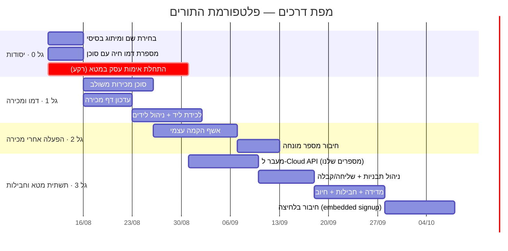

# תוכנית מוצר — פלטפורמת תורים חכמה בוואטסאפ

> מסמך חי. נכתב 11.8.2026. שם המוצר זמני עד לבחירה (ראה "שמות מועמדים").

## חזון
מערכת `SaaS` שמוכרת לעסקי־תורים (מספרות, ומעבר להן) **סוכן וואטסאפ חכם שקובע תורים 24/7**, יחד עם יומן, ניהול לקוחות, אוטומציות ותפוצה. המטרה של יאיר: עסק דיגיטלי שמוכר ומפעיל את עצמו, עם כמה שפחות מגע ידני ובלי שיחות טלפון.

---

## החלטות שננעלו (11.8.2026)
1. **שם:** כיוון אנגלי־בְּרנדבילי עם ואיב רגשי/מופשט. `DOMINANT` נשאר שם המספרה של יאיר בלבד, לא שם הפלטפורמה.
2. **משפך מוביל לפני מכירה:** מספרת דמו חיה (המספרה של דני) עם סוכן אמיתי → הליד חווה את הסוכן כלקוח → הסוכן עצמו הופך לסוכן מכירות ומפנה לרכישה.
3. **הרשמה עצמית מלאה — נשללה.** המערכת חסומה על חיבור מספר, לכן הפעלה אמיתית תמיד בליווי: אשף הקמה שנשלח אחרי הרכישה.
4. **תשתית וואטסאפ — שני ערוצים לבחירת הלקוח:** "מהיר" (גרין: זול/מיידי, לא רשמי) או "רשמי" (מטא: בטוח, עולה פר‑הודעה בתפוצה). שכבת הפשטה אחת מעל הספק; תפוצה המונית מעדיפה מטא. יאיר יהיה הספק בעצמו במטא, בגישה מדורגת (ראה E5).
5. **מיצוב מחיר:** פרימיום מכוון מעל השוק (מתחרים 100–250₪); מסלולים 350 / 500 / 700–1,000 (לאישור).

---

## ארכיטקטורת המשפך (מקצה לקצה)

| שלב | מה קורה | המטרה |
|---|---|---|
| 1. חשיפה | מודעה / הפניה / דף מכירה | להביא בעל־עסק להתעניין |
| 2. חוויה | מתכתב עם **מספרת הדמו** בוואטסאפ, חווה את הסוכן קובע לו תור | "וואו, זה עובד מדהים" |
| 3. מכירה | הסוכן עצמו פונה: "ראית איך זה עובד על מספרה אחרת — דמיין שזה שלך" → מפנה לדף מכירה / קובע שיחה | להמיר התעניינות לרכישה |
| 4. הקמה | אחרי רכישה נשלח קישור **אשף הקמה** — שירותים, שעות, צוות, חיבור מספר | להפעיל עסק חדש בלי מגע שלנו |
| 5. חבילה | בחירת חבילה (מכסת הודעות תפוצה + שימוש בסוכן) + חיוב | הכנסה חוזרת + כיסוי עלויות |
| 6. שימור | המערכת מייצרת ערך חוזר: תזכורות, שובר תורים, תפוצה, אוטומציות | להקטין נטישה |

**עוד רעיון שנרשם:** טרייל "סנדבוקס לקריאה" (דאטה מדומה, בלי לחבר מספר) כאופציה קלה למי שרוצה לגעת במערכת עצמה. לא מוביל — משני. הטרייל עם מספר משותף נדחה (בלגן טכני, ובלי הסוכן מוכר את החלק החלש).

---

## שבעת האזורים (Epics)

### E1 · מיתוג ומיצוב
- בחירת שם + לוגו + שפה ויזואלית בסיסית.
- מסר מכירה מרכזי (מה מבטיחים, למי).
- עדכון **דף המכירה** ("הדף ביזנס") — יאיר ציין שצריך לשנות בו דברים (לפרט).

### E2 · משפכי התנסות
- **מספרת הדמו (דני):** לוודא שהיא חיה, יציבה, עם סוכן שמתפקד פנומנלי.
- **סוכן מכירות משולב:** התנהגות חדשה לסוכן של מספרת הדמו — לזהות "מתעניין במערכת" (בשונה מלקוח שקובע תור), ואחרי חוויה מוצלחת לפנות ולמכור. פרומט ייעודי + כלי "לכידת ליד/הפניה".
- (אופציונלי) **סנדבוקס לקריאה** של מסך הניהול עם דאטה מדומה.

### E3 · CRM תפעולי לכל הסאס (מרכז שליטה) — מערכת נפרדת
**החלטה (11.8.2026):** מערכת **נפרדת לגמרי** משכבת האדמין של העסק — שכבת `super-admin` עליונה שרואה את כל העסקים, לא מוטמעת בתוך אדמין של עסק בודד. היום קיים חלקית אצל יאיר כ"מנהל ראשי" בתוך הפלטפורמה → מוציאים החוצה למערכת עצמאית.

מרכזת את *כל* פעילות ה‑`SaaS`:
- **פיצ'ר יסוד ראשון — מעקב טוקנים ועלות פר עסק:** כמה כל עסק צרך מ‑Anthropic API (טוקני קלט/פלט) וכמה זה עלה בכסף, פר תקופה. מזין ישירות את E6 (מדידה/מכסות) ואת E7 (עלות/תמחור).
- **לידים / פייפליין:** מתעניינים, מאיפה הגיעו, סטטוס (התעניין / בהתנסות / הצעה / נסגר), תיעוד. לכידה אוטומטית מהמשפך (מספרת הדמו → ליד).
- **לקוחות (עסקים משלמים):** סטטוס, מסלול, מצב הפעלה, בריאות/נטישה.
- **הכנסות ושימוש:** הכנסה חוזרת חודשית, צריכת סוכן ותפוצה פר עסק, חריגות ממכסה.
- **מעקב + נודניקים** על תשתית `mailhub` הקיימת.
- מתחבר ל"מנכ״ל" (סוכן‑העל) כמקור אמת לתחום ה‑`SaaS`.

**מצב קיים ותכנית מימוש (ממצאי קוד, 11.8.2026 — לתכנון, לא נבנה עדיין):**
- כבר קיים בסיס `super-admin` ב‑`/admin/super` (רשימת עסקים, לידים, impersonate); היום **מקונן בתוך ה‑shell של אדמין העסק** (חולק ניווט/עיצוב) → לנתק לאזור עצמאי (אופציה א': כניסה + layout נפרדים, אותו מסד נתונים).
- `isSuperAdmin` = ה‑owner של `SUPER_ADMIN_BUSINESS_ID`; helpers ב‑`src/lib/super-admin.ts` (`notifyPlatformOwner`).
- **הטוקנים כבר מחושבים** בכל `anthropic.messages.create` (`customer-agent.ts:1451`, `owner-agent.ts:1243`, `demo-sales-agent`, `question-followup`) + `openai-driver.ts:123` — אבל רק `console.log`, לא נשמרים.
- קיימים כבר מודלים `Lead` ו‑`AgentConfig`. אין מודל usage/cost.
- **מעקב טוקנים/עלות — צעדי בנייה:** (1) מודל `AgentUsage` (businessId, provider, model, inputTokens, outputTokens, cache, costUsd, createdAt) דרך `prisma db push`; (2) helper מרכזי `recordAgentUsage()` עם טבלת מחירים פר ספק/מודל; (3) לחווט את ~5 אתרי הקריאה; (4) API `/api/admin/super/usage` (מוגן `isSuperAdmin`) לאגרגציה פר עסק; (5) מסך באזור הנפרד: טוקנים + $ פר עסק (חודש / סה"כ). רב‑ספק (Anthropic + OpenAI).

### E4 · אשף הקמה עצמי (per-business)
- הקישור שנשלח אחרי רכישה: ראיון קצר שממלא שדות מובנים → מתקמפל להגדרת העסק (מבוסס על תכנון "פלואו הגדרת הסוכן" הקיים).
- שלבים: פרטי עסק → שירותים ומחירים → שעות פעילות → צוות → **בחירת ערוץ וחיבור מספר (מהיר/גרין או רשמי/מטא — ראה E5)** → הפעלה.
- יעד: בעל־עסק מגדיר לבד, בלי מגע שלנו.

### E5 · תשתית וואטסאפ — שני ערוצים לבחירת הלקוח
**עיקרון:** שכבת הפשטה אחת (`sendMessage` הקיים) מעל הספק, כך שכל עסק בוחר את הערוץ שלו והשאר בקוד לא משתנה. בהקמה (E4) הלקוח בוחר בין:

- **אופציה A — "מהיר" (גרין):** סריקת QR, המספר הקיים של העסק הופך לבוט תוך דקות. זול (12$/חודש), מיידי. חיסרון: לא רשמי → סיכון חסימה, בעיקר בתפוצה המונית.
- **אופציה B — "רשמי" (מטא / `Cloud API`):** חיבור המספר כמספר וואטסאפ ביזנס רשמי. בטוח, מאומת, בלי סיכון חסימה, מסירה גבוהה. חיסרון: הקמה כבדה יותר (אימות עסק), תפוצה עולה פר הודעה.

**כלל בטיחות לתפוצה:** תפוצה שיווקית המונית מעדיפה/מחייבת את הערוץ הרשמי (מטא); על גרין — אזהרת סיכון מפורשת. כך שיחות הסוכן זולות והתפוצה בטוחה.

**גישה מדורגת למטא (אופציה B):**
- שלב א' (עכשיו): `Cloud API` למספרים שלנו (דמו) + אונבורדינג ידני ללקוחות ראשונים. בלי ביקורת אפליקציה כבדה.
- שלב ב' (מיד, ברקע): אימות עסק במטא — הפוֹל הארוך, שער לכל השאר.
- שלב ג': ספק מאושר + **חיבור בלחיצה** (embedded signup) + ניהול תבניות והגשתן למטא.

**מימוש:** שדה `channel` פר עסק ("green" | "meta") + קרדנציאלס מתאימים; הראוטינג בשכבת הספק. היום קיים `greenApiInstanceId`/`greenApiToken` — מרחיבים.

**דרישות להפוך לספק רשמי של מטא (מה זה דורש מאיתנו):**
- *רמה 1 — להתחיל (מספיק לאונבורדינג ידני):* תיק עסקי במטא (Business Portfolio); **אימות עסק** ע"י מסמכים משפטיים (ח.פ/עוסק, כתובת) — הפוֹל הארוך, להתחיל מיד; WABA + מספר + אישור שם תצוגה; אמצעי תשלום על ה‑WABA.
- *רמה 2 — ספק טכנולוגי עם חיבור‑בלחיצה (Embedded Signup):* כל רמה 1 + אפליקציית מטא; **App Review** להרשאות `whatsapp_business_management` + `whatsapp_business_messaging`; מדיניות פרטיות + תנאי שימוש ציבוריים; הגדרת Embedded Signup + אישור; סטטוס Tech Provider.
- *להכין מראש:* ישות עסקית + מסמכים, אתר עם מדיניות פרטיות ותנאים, שם תצוגה תקין.
- *קיצור דרך אם נתקע:* BSP מאושר (360dialog/Twilio) שכבר נותן embedded signup — מרווח תמורת דילוג על הביקורת. (בחירת יאיר: ספק‑עצמי → רמה‑1 עכשיו, רמה‑2 בהמשך.)
- ⚠️ פרטי התהליך של מטא משתנים — לאמת מול התיעוד העדכני (צ'קליסט ייעודי) לפני ביצוע.

### E6 · חבילות, מדידה וחיוב
- מדידה (`metering`): כמה הודעות תפוצה + כמה שימוש בסוכן צרך כל עסק.
- הגדרת חבילות: מכסת הודעות תפוצה + מכסת שימוש בסוכן, פר רמת פעילות.
- חיוב חוזר + התראות על חריגה ממכסה.

### E7 · מודל עלות ותמחור (מזין את E6)
**עלויות שלנו פר עסק:** גרין ~12$ (שיחות) + סוכן (Anthropic) + תפוצת מטא פר הודעה + תשתית.
**מיצוב: פרימיום מכוון.** מתחרים 100–250₪. אנחנו יקרים בכוונה — הסוכן שקובע לבד מצדיק פי 2–4, והמחיר עצמו חלק מהמסר (יקר = רציני). פרימיום מחייב מכירה מלווה (המשפך), לא הרשמה עצמית.

**מסלולים מוצעים (₪/חודש, לאישור):**
| מסלול | קהל | מחיר |
|---|---|---|
| Solo | ספר/עסק קטן, בלי הרבה אופציות | ~350 |
| Pro | מספרה גדולה / מבוססת | ~500 |
| Premium | מכוני קוסמטיקה / מספרות נשים | 700–1,000 |

**מודל התמחור (usage-based — כי העלות משתנה פר עסק):**
שני מנועי עלות משתנים שאנחנו **כבר מודדים**: (א) שימוש בסוכן (`AgentUsage`, ~₪0.3–0.5/שיחת קביעה); (ב) הודעות וואטסאפ (`MessageLog`; גרין=פלט $12/מספר, מטא=פר הודעת תפוצה ~₪0.1–0.2, תשובות שיחה ~חינם).

**המודל המומלץ:** מסלול קבוע + **מכסות כלולות** (שיחות סוכן + הודעות תפוצה לחודש) + חריגה→שדרוג/חיוב נוסף. חשבון צפוי ללקוח, פרימיום, ומרווח מוגן (התקרה דוחפת שימוש כבד למעלה).

| מסלול | שיחות סוכן/חודש | תפוצה/חודש |
|---|---|---|
| Solo (~350) | ~300 | ~400 |
| Pro (~500) | ~1,000 | ~1,500 |
| Premium (700–1,000) | ~2,500 | ~4,000 |
*(להמחשה — מכיילים כך שגם בתקרה המרווח >50%, מאמתים מול הדאטה האמיתי בטאב "עלויות".)*

**מה לבנות (מערכת התמחור):** (1) שדות plan+מכסות פר עסק; (2) מונים: שיחות מ‑`AgentUsage`, תפוצה מ‑`MessageLog` — **הדאטה כבר קיים**; (3) תצוגת שימוש‑מול‑מכסה בטאב עלויות; (4) התראות 80%/100% + חריגה; (5) חיוב חריגה (מתחבר ל‑E9 סליקה).
> **נבנה ונפרס (17.8.2026):** `AgentUsage.conversationId` + מונה שיחות/תפוצה מול מכסת ה‑tier + פסי שימוש בטאב "עלויות" (commit a787e3a). נותר: אכיפה/חיוב.

**מסלול חינם (freemium — on-ramp לשירות עצמי):** עד ~50 תורים/חודש, על **מספר הוואטסאפ של המערכת** (משותף), רוב ההתראות ב‑**push מהאפליקציה** (`pushToken` כבר קיים על Customer), ו‑**תזכורת אחת בלבד** לפני התור בוואטסאפ. **בלי סוכן AI ובלי מספר משלו** — אלה השדרוג. פותר את חסם השירות‑העצמי (אין צורך לחבר מספר) *ואת* דאגת המספר‑המשותף (חינם = יוצא בלבד, לא שיחת AI נכנסת). עלות ≈ אפס. משתמשי חינם = לידים חמים לשדרוג ל‑AI (מזין את משפך המכירה E2). מימוש: tier "free" + מכסת 50 תורים + גייטינג אוטומציות לתזכורת אחת.

### E8 · ריבוי‑וורטיקל: בחירת סוג עסק + פרומטים/שאלות לפי סוג
> **אפיון מעמיק (16.9.2026):** המערכת — `docs/PLAN-VERTICALS.md` · הסוכן — `docs/PLAN-VERTICALS-AGENT.md` (אותם שלבים 0–4; הסוכן לומד רק מה שהלקוחה צריכה להגיד/לשמוע).
בעת פתיחת המערכת הלקוח **בוחר סוג עסק** (מספרת גברים / מספרת נשים / מכון קוסמטיקה / …). הבחירה קובעת:
- **פרומט סוכן שונה** לכל סוג — ההתנהגות והשפה של סוכן למספרת‑נשים שונים מקוסמטיקה מגברים.
- **שאלות הקמה שונות** באשף (E4) — מה ששואלים מספרת‑נשים ≠ מכון קוסמטיקה.
מכוני קוסמטיקה/נשים = כאב גדול ומשלמים יותר (700–1,000₪), אבל דורשים **שינוי מערכתי**: טיפולים ארוכים/מרובי‑שלב, סדרות וחבילות, כמה אנשי צוות לתור, מקדמות/דיפוזיט. נבנה על תשתית `setupConfig`/`setup-fields` הקיימת (פרומט + שאלות פר סוג).

### E9 · סליקה וחיוב (תשלומים)
חיבור חברת סליקה לאפליקציה, לשני שימושים: (א) **חיוב חוזר** של מנוי ה‑SaaS — טוקניזציית כרטיס + חיוב חודשי לפי המסלול/חריגה (מתחבר ל‑E6/E7); (ב) בעתיד **מקדמות/דיפוזיט** מלקוחות (רלוונטי לקוסמטיקה, E8). ספקים ישראליים אפשריים: Cardcom / Tranzila / Meshulam / Grow (חשבונית ירוקה) / Stripe. דרישת ליבה: תמיכה בחיוב חוזר + חשבוניות.

---

## גאנט — מפת דרכים

**היגיון הסדר:** קודם מוכרים (גל 0–1), אחר כך מפעילים את מי שקנה (גל 2), ותשתית מטא/חבילות רצה כמסלול מקביל שלא חוסם מכירות (גל 3). אימות העסק במטא מתחיל ביום 1 כי הוא הפוֹל הארוך.

---

## קלטים שאני צריך מיאיר
- [x] עלות `GreenAPI`: **12$ לחודש, נפח בלתי מוגבל** (פר instance/מספר). ⇐ ראה הערת עלות למטה.
- [x] מחיר יעד: מתחרים 100–250₪; מיצוב פרימיום — Solo ~350, Pro ~500, Premium (קוסמטיקה/נשים) 700–1,000. מסלולים לאישור.
- [ ] יש חשבון עסקי במטא (לניהול דף/מודעות של המספרה) שישמש מטרייה ל‑WABA, או מתחילים נקי?
- [ ] דף המכירה — אילו שינויים רצית?

> **הערת עלות מהותית:** `GreenAPI` ב‑12$ בלתי מוגבל *אינו* יקר. הבעיה שלו: הוא **לא רשמי → סיכון חסימה** (בעיקר בתפוצה), והעלות היא **פר מספר** (מתרבה עם כל לקוח). מטא הוא ההפך: **בטוח ורשמי**, תשובות שיחה כמעט חינם, אבל **תפוצה שיווקית עולה פר הודעה** — כלומר תפוצה במטא *יקרה יותר* מגרין, לא זולה. לכן הסיבה האמיתית למעבר היא **לגיטימיות ואי‑חסימה**, וזה בדיוק מה שהופך את חבילות התפוצה (E6) להגיוניות: גובים על מה שבאמת עולה לנו.

## שמות מועמדים (כיוון אנגלי־בְּרנדבילי + רגשי)
לבחירה/סינון — זמינות דומיין וסימן מסחרי ייבדקו אחרי שנצמצם ל־2–3.

**עם ואיב של "עוזר אישי" (חם, אנושי):**
- Robin — עוזר נאמן שסוגר לך את התורים
- Miko — שם עוזר ידידותי, קליל בכל שפה
- Cleo — עוזרת אלגנטית ומקצועית

**עם ואיב מופשט/רגשי:**
- Presto — "אחת־שתיים־קסם", התור נקבע לבד
- Halo — נוכחות שמקיפה ושומרת על העסק
- Kept — "הכול מנוהל, אתה מכוסה"
- Booked — כל בעל־עסק חולם להיות "fully booked"
- Zenith — שקט־נפשי + שיא ביצועים
